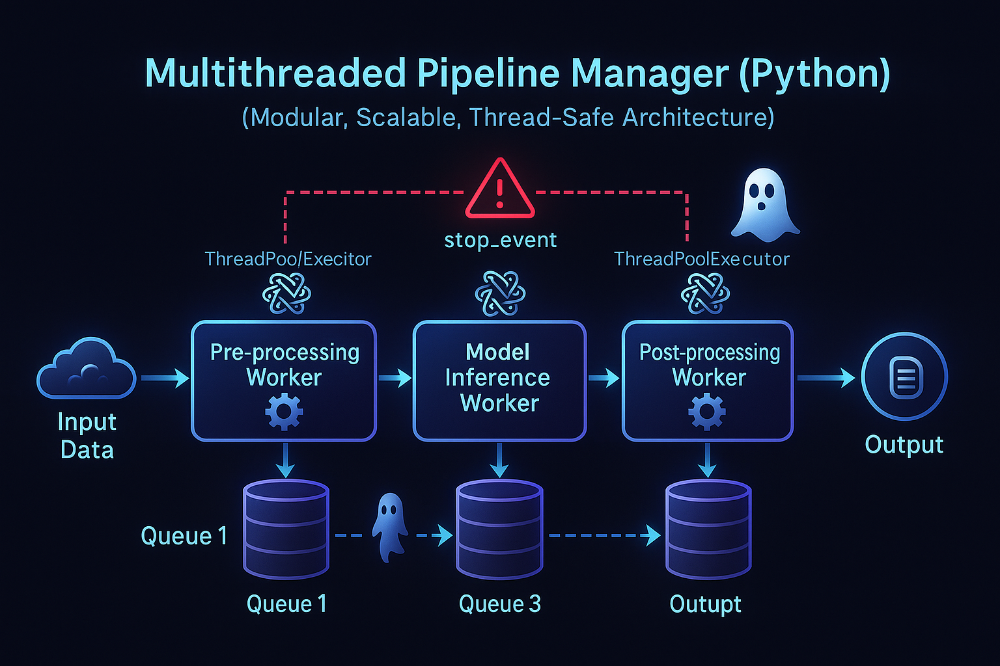

# Multithreaded Pipeline Manager in Python



A reusable, beginner-friendly code template for creating generic multithreaded data processing pipelines in Python. This repository demonstrates how to build robust pipelines that can handle pre-processing, model inference (simulated), and post-processing stages concurrently, with support for parallelizing CPU-bound sub-tasks within a stage.

## Table of Contents

- [Motivation](#motivation)
- [Core Design Concepts](#core-design-concepts)
  - [Threads vs. Processes](#threads-vs-processes)
  - [Queues for Inter-Thread Communication](#queues-for-inter-thread-communication)
  - [Sentinel Values for Graceful Shutdown](#sentinel-values-for-graceful-shutdown)
  - [Stopping Events for Error Handling](#stopping-events-for-error-handling)
  - [ThreadPoolExecutor for Parallel Sub-tasks](#threadpoolexecutor-for-parallel-sub-tasks)
  - [Deadlock and Race Condition Prevention](#deadlock-and-race-condition-prevention)
  - [Modularity and Reusability](#modularity-and-reusability)
- [Repository Tour](#repository-tour)
  - [File Structure](#file-structure)
- [Quick Start](#quick-start)
- [How It Works](#how-it-works)
  - [High-Level Diagram](#high-level-diagram)
  - [Stage-by-Stage Explanation](#stage-by-stage-explanation)
  - [Code Walkthrough (Key Components)](#code-walkthrough-key-components)
- [Extending to Real Workloads](#extending-to-real-workloads)
- [Troubleshooting Cheatsheet](#troubleshooting-cheatsheet)
- [License](#license)
- [Contributing](#contributing)

## Motivation

Many data processing and machine learning tasks involve a sequence of steps (a pipeline). Running these steps sequentially can be slow, especially if some steps are I/O-bound or CPU/GPU-bound. Multithreading allows different stages of the pipeline to run concurrently, improving throughput and reducing overall processing time.

This repository helps you:
- Understand the fundamentals of multithreaded pipelines.
- Implement robust pipelines with proper error handling.
- Parallelize CPU-bound sub-tasks using `ThreadPoolExecutor`.
- Adapt a generic structure for real-world projects.

## Core Design Concepts

### Threads vs. Processes
- **Threads** share memory and are lightweight—ideal for I/O-bound or GIL-releasing tasks.
- **Processes** are isolated—better for CPU-bound tasks in native Python.
- This template uses **threads**, assuming I/O and C-based libraries release the GIL.

### Queues for Inter-Thread Communication
- `queue.Queue` is used for safe, thread-safe communication.
- Follows a **producer-consumer** pattern.
- Supports **backpressure** using `maxsize`.

### Sentinel Values for Graceful Shutdown
- A unique object like `SENTINEL = object()` signals the end of data.
- Workers propagate `SENTINEL` downstream and exit cleanly.

### Stopping Events for Error Handling
- A shared `threading.Event` (`stop_event`) lets workers shut down gracefully on error.

### ThreadPoolExecutor for Parallel Sub-tasks
- Used within a stage (e.g. post-processing) to run multiple sub-tasks in parallel.

### Deadlock and Race Condition Prevention
- Clear data flow with `Queue`.
- `robust_put()` handles blocking puts with timeout and stop signal.
- Shared state should use `threading.Lock`.

### Modularity and Reusability
- Create new stages by subclassing `BaseWorker`.
- `PipelineManager` handles orchestration.

## Repository Tour

### File Structure

```

multithreaded-pipeline-manager-python/
├── pipeline\_core/
│   ├── **init**.py
│   ├── pipeline\_manager.py
│   └── utils.py
├── demo.py
└── README.md

````

- **`pipeline_core/pipeline_manager.py`**: `PipelineManager` and `BaseWorker` classes.
- **`pipeline_core/utils.py`**: Utility functions (`robust_put`, `SENTINEL`, logger).
- **`demo.py`**: Demonstrates building and running a pipeline.

## Quick Start

1. Clone or copy files:

```bash
# git clone https://github.com/yourusername/multithreaded-pipeline-manager-python.git
# cd multithreaded-pipeline-manager-python
````

2. Ensure Python 3.8+ is installed.

3. Run the demo:

```bash
python demo.py
```

## How It Works

### High-Level Diagram

```
Input Data --> Queue 1 --> PreProcessingWorker --> Queue 2 --> ModelInferenceWorker --> Queue 3 --> PostProcessingWorker --> Final Output
                                                (Simulated)                            (with ThreadPoolExecutor for sub-tasks)
```

### Stage-by-Stage Explanation

* **Data Producer**: Feeds items into the first queue.
* **PreProcessingWorker**: Simulates data prep.
* **ModelInferenceWorker**: Simulates model inference, may raise errors.
* **PostProcessingWorker**: Submits sub-tasks to a thread pool, buffers and orders results.

### Code Walkthrough (Key Components)

#### `PipelineManager`

* Manages `stop_event`, progress bar, workers, and queues.
* `add_worker()`, `start()`, `wait_for_completion()`.

#### `BaseWorker`

* Implements `_run()` and requires `process_item(item)` to be defined.
* Handles queue communication and `SENTINEL` passing.

#### `robust_put` and `SENTINEL`

* Handles blocked puts safely with timeouts and stop checks.

#### Parallel Post-Processing

* `PostProcessingWorker` uses a thread pool for parallel sub-tasks.
* Buffers and re-orders results for consistent output.

## Extending to Real Workloads

* Subclass `BaseWorker` to define custom stages.
* Use `PipelineManager` to build your pipeline.
* Handle exceptions inside `process_item`.
* Use `robust_put` to safely queue items.
* Tune performance via queue sizes, worker count, etc.

## Troubleshooting Cheatsheet

| Symptom                   | Cause                                              | Fix                                                                 |
| ------------------------- | -------------------------------------------------- | ------------------------------------------------------------------- |
| Pipeline hangs            | Blocked producer or consumer died                  | Use `robust_put`, ensure `SENTINEL` is passed, avoid circular waits |
| Data not processed        | `SENTINEL` not propagated or workers exit early    | Ensure each stage sends and reacts to `SENTINEL` properly           |
| Race conditions           | Shared state accessed without lock                 | Use `threading.Lock`                                                |
| High idle CPU             | Busy-waiting threads                               | Use `queue.get(timeout=...)`                                        |
| Errors in sub-tasks       | Exceptions in executor workers                     | Catch and handle exceptions in sub-task functions                   |
| Progress bar not updating | Missing `pbar.update()` or wrong `num_total_items` | Ensure correct configuration                                        |

## License

This project is licensed under the MIT License - see the [LICENSE](LICENSE) file for details.

## Contributing

Feel free to fork and submit pull requests to improve functionality or documentation. Suggestions and issues are welcome.